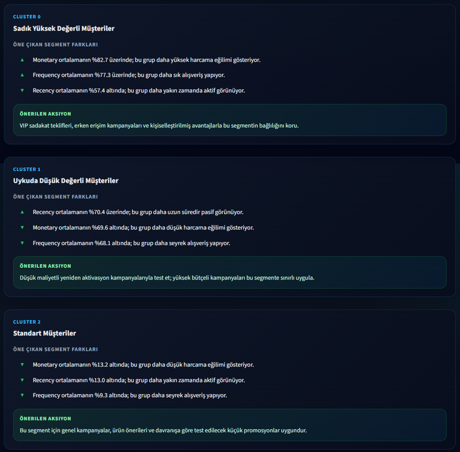
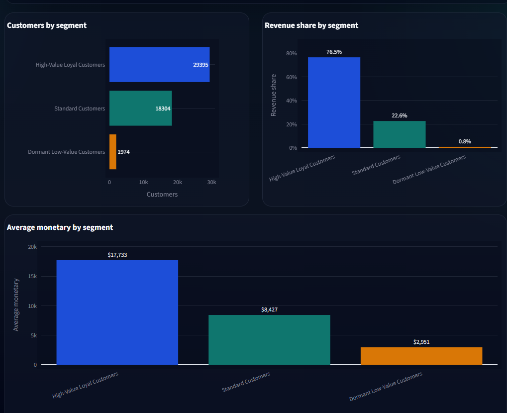
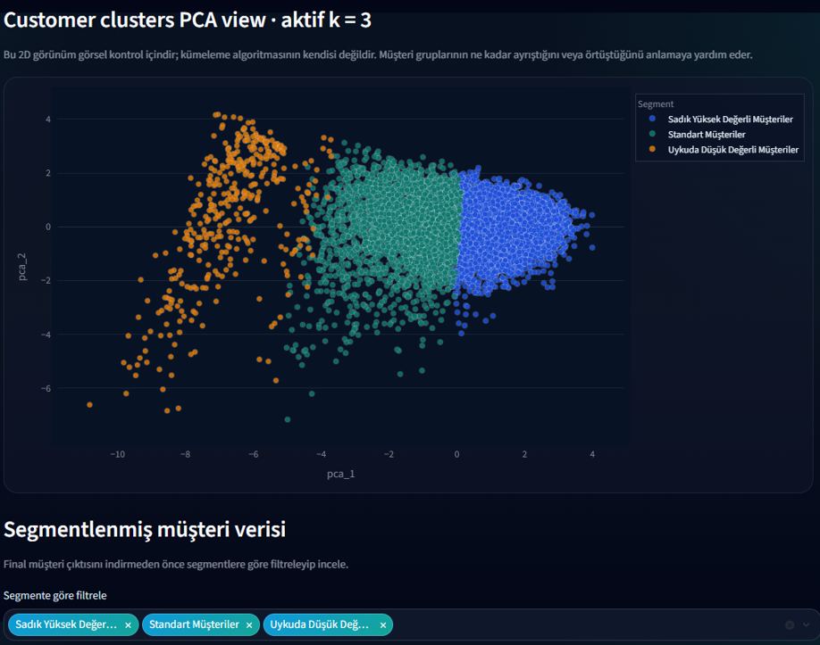
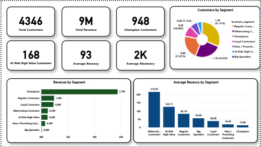
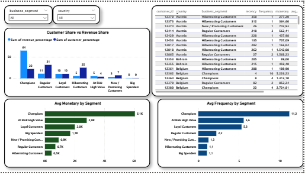
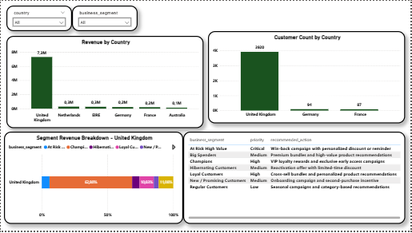

# CustomerLens BI

**CustomerLens BI** is a hybrid **Business Intelligence + Machine Learning** customer segmentation project.

The project combines two layers:

1. **Manual RFM analysis and BI reporting** using SQL and Power BI
2. **Interactive customer segmentation application** using Streamlit, KMeans clustering, silhouette-based cluster guidance, PCA visualization, segment insights, and CSV export

The goal is to turn customer-related datasets into interpretable customer segments that can support marketing, retention, and business decision-making.

---

## Project Preview

### Interactive Streamlit Segmentation Workspace

The Streamlit app allows users to upload their own customer, transaction, or profile CSV files, map columns, generate customer-level features, run KMeans clustering, rename segments, inspect segment insights, and export results.







---

## Manual RFM Analysis & Power BI Reporting

Before building the interactive app, the project includes a traditional business analytics layer based on RFM-style segmentation.

This part focuses on:

* Customer-level RFM feature creation
* Business segment assignment
* Segment-level KPIs
* Revenue contribution analysis
* Country-level marketing opportunities
* Recommended marketing actions by segment

### Executive Overview



### Segment Deep Dive



### Country & Marketing Actions



---

## Why This Project?

Customer segmentation is often approached in two separate ways:

* Business teams use rule-based methods such as RFM segmentation.
* Data teams use machine learning methods such as clustering.

This project combines both perspectives.

The manual RFM layer provides a familiar business interpretation, while the Streamlit app adds flexibility by allowing users to upload different CSV structures and generate upload-specific customer clusters.

The project is designed as a practical BI/ML workspace rather than a static notebook.

---

## Key Features

### BI / RFM Analysis Layer

* SQL-based customer feature preparation
* RFM-inspired business segmentation
* Power BI dashboard pages
* Segment-level KPIs
* Revenue and customer share analysis
* Country-level performance breakdown
* Recommended marketing actions by segment

### Streamlit ML Application

* Demo dataset support
* Custom CSV upload
* Customer feature CSV support
* Transaction/order CSV support
* Customer profile CSV support
* Interactive column mapping
* Customer-level feature engineering
* Upload-specific KMeans clustering
* Silhouette score analysis for different `k` values
* Technical best `k` and business-friendly `k` guidance
* Manual cluster count selection
* Automatic segment name suggestions
* Custom segment renaming
* Segment size warning system
* Segment insight cards
* Recommended actions for each segment
* Segment-level charts
* PCA cluster visualization
* Filterable segmented customer table
* Full segmented CSV export
* Separate CSV export for each segment as a ZIP file
* Turkish / English interface support

---

## Supported CSV Types

The Streamlit app is designed to handle different customer-related CSV structures.

### 1. Customer Feature CSV

A customer-level file where each row already represents one customer.

Expected behavioral features may include:

```text
customer_id
recency
frequency
monetary
avg_order_value
unique_products
total_quantity
customer_lifetime_days
```

This is the most controlled input format for clustering.

---

### 2. Transaction / Order CSV

A raw transaction dataset where each row represents an order, invoice, item line, or purchase event.

Example columns:

```text
customer_id
order_id
order_date
quantity
unit_price
total_amount
product_id
country
```

The app can aggregate this type of data into customer-level behavioral features.

---

### 3. Customer Profile CSV

A profile-style dataset where each row represents a customer but may not contain full transaction history.

Example columns:

```text
Customer ID
Age
Gender
Purchase Amount
Previous Purchases
Location
Frequency of Purchases
```

If fields such as recency or transaction dates are missing, the app uses safe defaults and warns the user when segmentation quality may be limited.

---

## How the App Works

The Streamlit application follows this workflow:

```text
Upload CSV
↓
Detect dataset type
↓
Suggest column mappings
↓
User confirms or edits mappings
↓
Generate customer-level features
↓
Scale and transform features
↓
Evaluate k range using silhouette score
↓
Recommend a business-friendly k
↓
Run upload-specific KMeans clustering
↓
Generate segment profiles
↓
Suggest readable segment names
↓
Show insight/action cards
↓
Visualize segment charts and PCA
↓
Export final segmented customers
```

---

## Clustering Logic

The app does not apply a fixed pre-trained clustering model to every uploaded dataset.

Instead, each uploaded CSV is clustered on its own distribution.

This is an important design decision because customer behavior can vary significantly between datasets. A segment definition learned from one dataset may not transfer well to another.

The app uses:

* `StandardScaler` for numerical scaling
* `log1p` transformation for skewed monetary/frequency-like features
* `KMeans` for clustering
* `silhouette_score` for cluster quality guidance
* `PCA` for 2D visual inspection

---

## Segment Interpretation

After clustering, the app builds a profile for each segment using metrics such as:

```text
customer count
customer share
average recency
average frequency
average monetary
average order value
average unique products
average total quantity
average customer lifetime
revenue share
```

The app then generates:

* Suggested segment names
* Segment driver explanations
* Recommended business actions
* Segment size warnings when needed

Example segment types:

```text
High-value loyal customers
Loyal regular customers
Standard customers
Dormant low-value customers
At-risk high-value customers
Premium occasional customers
```

---

## Export Options

The app supports two export modes:

### Full segmented CSV

Exports the final customer table with segment columns such as:

```text
ml_cluster
ml_segment
customer_segment
cluster_id
```

### Separate segment CSV files

Exports each customer segment as a separate CSV file inside a ZIP archive.

This makes the output more useful for campaign targeting, segment-specific analysis, or marketing workflows.

---

## Project Structure

```text
CustomerLens BI/
│
├── app/
│   ├── app.py
│   ├── clustering_utils.py
│   ├── data_utils.py
│   ├── model_utils.py
│   ├── ui_utils.py
│   ├── style.py
│   ├── translations.py
│   ├── requirements.txt
│   │
│   └── data/
│       ├── customer_segments_with_ml.csv
│       ├── kmeans_model.pkl
│       ├── scaler.pkl
│       ├── features.json
│       ├── cluster_labels.json
│       └── test_datasets/
│
├── data/
│   ├── processed/
│   ├── outputs/
│   └── scripts/
│
├── notebooks/
│   └── customer_lens_bi.ipynb
│
├── powerbi/
│   ├── customer_segmentation.pbix
│   ├── executive_overview.png
│   ├── segment_deep_dive.png
│   └── country_marketing_actions.png
│
├── reports/
│   ├── ss1.png
│   ├── ss2.png
│   ├── ss3.png
│   └── additional report screenshots
│
├── sql/
│   ├── 01_create_raw_table.sql
│   ├── 02_create_clean_table.sql
│   ├── 03_create_customer_features.sql
│   ├── 04_create_rfm_scores_and_segments.sql
│   ├── 05_create_powerbi_views.sql
│   └── README_sql_pipeline.md
│
├── .gitignore
└── README.md
```

---

## Tech Stack

### App

* Python
* Streamlit
* Pandas
* NumPy
* Scikit-learn
* KMeans
* Silhouette Score
* PCA
* Plotly
* Custom CSS

### BI / Analytics

* SQL
* Power BI
* RFM Analysis
* Customer segmentation logic
* Marketing action mapping

---

## How to Run Locally

Clone the repository:

```bash
git clone https://github.com/iadnankaanGameDev/customerlens-bi.git
cd customerlens-bi
```

Create and activate a virtual environment:

```bash
python -m venv .venv
```

On Windows:

```bash
.venv\Scripts\activate
```

Install dependencies:

```bash
pip install -r app/requirements.txt
```

Run the Streamlit app:

```bash
cd app
streamlit run app.py
```

---

## Notes on Large Data

One large raw test dataset was removed from Git tracking to keep the repository lightweight.

The app still includes smaller test datasets and demo data for local testing.

For larger datasets, the app uses sampling in expensive steps such as silhouette evaluation and PCA visualization to improve performance.

---

## Known Limitations

* Profile-only datasets without real date or recency fields may produce limited RFM-style interpretation.
* Silhouette score is a technical clustering metric and should not be treated as the only business decision criterion.
* PCA is only a 2D projection and may not fully represent high-dimensional cluster separation.
* Automatic column detection is helpful but may require user correction.
* KMeans assumes roughly distance-based cluster structure and may not fit every customer distribution.

---

## Future Improvements

Possible next improvements:

* Optional rule-based RFM segmentation inside the Streamlit app
* ML vs RFM segment comparison table
* More advanced clustering methods such as Gaussian Mixture Models or DBSCAN
* Outlier detection
* More detailed campaign recommendation engine
* Additional visual explanations for segment drivers
* Streamlit Cloud deployment
* Portfolio case-study page integration

---

## Project Positioning

This project is best understood as a practical customer segmentation workspace.

It does not claim that every CSV automatically produces perfect customer segments. Instead, it focuses on building a flexible and transparent workflow that helps users:

* Convert different customer-related data structures into customer-level features
* Explore segment structures using ML clustering
* Interpret customer groups with business-friendly labels and insights
* Export segment-level customer lists for further analysis or marketing actions

The main value of the project is the combination of traditional BI thinking with an interactive ML-powered segmentation application.
